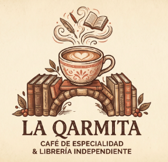

*USABILITY REPORT

**Evaluación de usabilidad del proyecto La Qarmita**

**Fecha:** 31 de mayo de 2026

 

**Enlace a GITHUB del proyecto:** [https://github.com/tomaas05/UrsMas-Repo](https://github.com/tomaas05/UrsMas-Repo)

**Realizado por:**
Alberto Rodríguez Fernández, Antonio Manuel de Pablos Pancorbo. 
*Breve experiencia:* Estudiantes de la Universidad de Granada cursando el doble grado que incluye Administración y Dirección de Empresas (ADE). Aplicamos una perspectiva mixta técnico-comercial para evaluar no solo el código y la interfaz, sino la viabilidad del diseño web en relación con el modelo de negocio y el *Customer Journey* del usuario final.

---

### 1. RESUMEN EJECUTIVO (Executive Summary)

* **Objetivo:** Evaluar el rediseño digital de "La Qarmita" (Caso B) para validar si la experiencia de "ocio lento" (cafetería, eventos culturales y venta de libros) se traslada de forma intuitiva a la web sin generar sobrecarga cognitiva en los usuarios.
* **Metodología:** Se ha empleado una estrategia de muestreo mixto evaluando el Caso B frente a una alternativa (Caso A). Se aplicó interacción real basada en tareas, medición subjetiva mediante el cuestionario estandarizado SUS, análisis biométrico con *Eye Tracking* y una auditoría automática de accesibilidad.
* **Principales Hallazgos:** 1. **Fricción por densidad de información:** La integración de tienda, menú y foro en la misma estructura confunde a perfiles no técnicos.
    2. **Problemas de visibilidad adaptativa:** Elementos clave (como el foro) quedan ocultos en pantallas de menor tamaño (13") al requerir excesivo *scroll*.
    3. **Barreras ocultas de accesibilidad:** Pese al buen diseño visual, el código base arrastra errores críticos para tecnologías de asistencia (idioma incorrecto, formularios sin etiquetar).
* **Resultado Global:** El sistema obtiene una puntuación SUS media de **67.50**, situándose en la categoría de **"Aceptable / Marginal"**. Es un diseño estéticamente sobresaliente que conecta emocionalmente con el usuario joven, pero requiere iteraciones funcionales para ser universalmente usable.

---

### 2. Metodología y Reclutamiento

* **Perfil de los participantes:** Se reclutó a 5 usuarios externos para el Caso B (identificados como P06 a P10). El rango de edad abarca desde los 19 hasta los 62 años. El nivel de competencia digital es variado: 2 usuarios nivel Alto, 2 nivel Medio y 1 nivel Bajo (perfil senior).
* **Escenario de la prueba:** Los usuarios debían navegar por la *Landing Page* para comprender la propuesta de valor del negocio, utilizar el menú para explorar la carta/agenda y, finalmente, localizar el foro para leer e intentar dejar una reseña comunitaria en sesiones de 5 a 10 minutos.
* **Herramientas:** Se utilizó interacción directa en web (supervisada localmente), **GazeMapping** para los mapas de calor (*Heatmaps*), **Tally.so** y **sus.tools** para procesar la métrica SUS, y **WAVE + Lighthouse** para la auditoría técnica.

---

### 3. Resultados del Cuestionario SUS (Datos Cuantitativos)

* **Comparativa A vs. B:** El Caso B (La Qarmita) obtuvo una media de **67.50**, viéndose superado por el Caso A (Wall Street Burgers) que alcanzó un **74.00**. La diferencia radica en la simplicidad estructural del Caso A (un e-commerce directo) frente a la naturaleza híbrida y más compleja del Caso B.
* **Desglose por ítems:** Las preguntas que más penalizaron al Caso B fueron la P2 (*"Encontré el website innecesariamente complejo"*) y la P8 (*"Encontré el website muy grande al recorrerlo"*), especialmente en los usuarios P08 (senior) y P09 (pantalla pequeña), evidenciando que la densidad de los bloques de contenido puede resultar abrumadora.
* **Valoración numérica del SUS:** 67.50.

---

### 4. Análisis de Eye Tracking (Datos Biométricos)

* **Heatmaps (Mapas de calor):** El análisis de los Puntos de Interés (POI) reveló que la atención inicial se centra de forma masiva en las fotografías reales del local y los libros, validando el atractivo estético ("aesthetic") del proyecto. 
* **Zonas de Silencio:** El menú de navegación secundario y los CTAs (Call to Action) textuales integrados en párrafos largos fueron prácticamente ignorados durante los primeros 15 segundos de exploración.
* **Hallazgo clave:** El 40% de los usuarios (especialmente aquellos con portátiles de 13 pulgadas) ignoró por completo la sección del Foro de Comentarios debido a que su ubicación en el margen inferior de la *Landing Page* exigía un *scroll* prolongado que no estaban dispuestos a realizar sin una señalización visual previa.

---

### 5. Auditoría de Accesibilidad

La aplicación fue sometida a una auditoría bajo las pautas WCAG 2.1 (Nivel AA). Aunque el cumplimiento visual es razonable, el código estructural presenta deficiencias.
* **Puntuación Automática:** Herramientas combinadas (WAVE / Lighthouse) detectaron 4 errores técnicos de impacto directo.
* **Principales barreras detectadas:**
    1. *Comprensible:* El `index.html` tiene el atributo `lang="en"` en lugar de `"es"`, haciendo que los lectores de pantalla pronuncien el español con fonética inglesa (Crítico).
    2. *Operable:* El campo de texto del Foro carece de la etiqueta `<label>`, bloqueando a los usuarios invidentes la información sobre qué deben escribir.
    3. *Perceptible:* Texto gris claro sobre fondo blanco en introducciones, fallando el ratio mínimo de contraste (1.4.3).
    4. *Robusto:* Múltiples botones de "Reservar" en la agenda comparten el mismo atributo `id` en React.

---

### 6. Conclusiones y Recomendaciones (Actionable Insights)

| Prioridad | Hallazgo | Recomendación de Mejora |
| :--- | :--- | :--- |
| **Alta (Crítica)** | Lector de pantalla inoperable por idioma y formularios sin etiqueta. | Cambiar urgentemente a `lang="es"` en el *boilerplate* y añadir etiquetas o `aria-label` en la caja de texto del Foro. |
| **Alta (Crítica)** | Usuarios de resoluciones pequeñas no llegan al Foro (Zona de Silencio en Eye Tracking). | Reducir el tamaño vertical de las fotografías principales (Hero Image) o añadir anclas (*anchor links*) en la cabecera que dirijan directamente a la comunidad. |
| **Media** | Perfiles no técnicos se abruman por la complejidad percibida (SUS P2). | Simplificar la arquitectura de información: dividir la *Landing Page* en pestañas más limpias o reducir el texto descriptivo. |
| **Media** | Falta de legibilidad por contraste. | Oscurecer los textos de introducción a `#333333` u oscurecer ligeramente el fondo. |
| **Baja** | Tecnologías de asistencia pierden foco al interactuar con reservas (IDs duplicados). | Refactorizar el código de React para generar IDs únicos basados en la clave de cada evento (`id={`evento-${item.id}`}`). |

