# DIU26
Prácticas Diseño Interfaces de Usuario (Tema: Hamburguerserías) 

* [Guiones de prácticas](GuionesPracticas/)
* [Case Study](Guia_CaseStudy.md)
* [Hall of fame](https://github.com/mgea/DIU/tree/master/hall_of_fame) 
* [Recursos/plantillas en Figma](https://www.figma.com/design/BN2IR0q2clOSplfMmalh9K/DIU_Toolkit_Framework--2026-)

El documento **README.md** del repositorio UX_CaseStudy es el esqueleto del documento de caso de estudio UX de la aplicación a desarrollar. 
Ahora mismo es un "esqueleto" que contiene y organiza la información que se espera en cada paso. 
Se tiene que redactar correctamente y eliminar todo lo que no sea necesario, respetando la estructura general del proceso. 
Se puede "mejorar" o innovar pero siguiendo un criterio claro y legible. Se **valorará la calidad de la exposición del Caso de Estudio y la información incluida**. 

* [Enlace al Prototipo Figma (P3)](https://www.figma.com/design/EcflaKpYL0jVP59BLETOzQ/Dise%C3%B1o-Sistema?m=auto&t=szcr0lgR3elgUFrY-1)
* [Enlace a la Aplicación React (P4)](https://www.figma.com/make/RNMefk5sTP5USA9a05kYDV/Crear-aplicaci%C3%B3n-dise%C3%B1o-at%C3%B3mico?t=fy4pVEjMTT9vtP7p-1&preview-route=%2Fcart). El código compilado también está disponible en la carpeta /dist

  

# Pasos

* **Datos del proyecto** (en cabecera del documento) 
  * Nombre del proyecto, logotipo, tipología (depende del grupo de prácticas) y breve descripción del proyecto
  * Datos del equipo (nombre del grupo, grupo de prácticas al que pertenece y nombre de miembros).
  * Elmiminar todos los elemento que no sean necesarios
 
* **Información desglosada en pasos**
  * Organizar información del Caso de Estudio en 5 pasos (que corresponde a las 5 prácticas)  
  * Incluir la información más relevante para comprender y explicar objetivos y resultados de cada paso
  * La **documentación que sea de apoyo** para ese Paso irá en una carpeta (P1,...P5) que estará indexada desde cada apartado.
  * Usar tamaños de imágenes y documentos de apoyo que sean fácilmente legibles en entorno Github (PDF, .md)  
  * Finalizar cada paso con una **breve conclusión de lo aprendido en ese paso y para qué nos servirá**

 
* **Conclusión final**
  * Terminar con un apartado específico de **conclusiones** finales y valoración de las prácticas, indicando cómo se ha seguido la metodología UX y
   valoración (positiva /negativa) de los resultados obtenidos. ¿Qué se ha aprendido del proceso? ¿Qué se puede mejorar? 

  

# Proceso de Diseño 

## Paso 0. My UX-Case Study

**Grupo**: DIU3_AntonioManueldePablosPancorbo/AlbertoRodriguezFernandez.COMPIS  

**Curso**: 2026 

**Actualizado**: 12/05/2026

**Nombre del Proyecto**: Wall Street Burguer    
 
**Descripción**: Nuestra propuesta transforma la plataforma digital de Goiko en un entorno interactivo y gamificado, inspirado en el mercado de valores. Bajo el concepto de explorar 'Sabores con encanto', hemos rediseñado su web para que el precio de las hamburguesas fluctúe en tiempo real según la demanda de la comunidad. Las burgers menos populares bajan de precio para ser 'rescatadas', incentivando a los usuarios a probar recetas diferentes mediante un botón de 'Invertir'. Todo esto se apoya sobre una interfaz rápida y optimizada, integrando filtros de alérgenos accesibles y solucionando los problemas de usabilidad detectados en el diseño actual de Goiko.                

**Logotipo y Slogan**: 

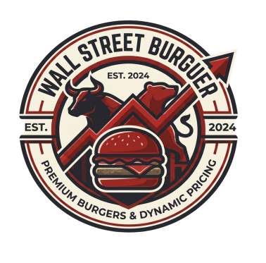

*Goiko's Change. Tu cartera de inversión nunca tuvo tan buena pinta.*

**Miembros y nombre del equipo**:
 * :bust_in_silhouette:  ANTONIO MANUEL DE PABLOS PANCORBO    :octocat: https://github.com/amdepabloss    
 * :bust_in_silhouette:  ALBERTO RODRÍGUEZ FERNÁNDEZ     :octocat: https://github.com/AlbertoRodriguezFernandez

    

## Paso 1. UX User & Desk Research & Analisis 

### 1.a User Reseach Plan
 
-----

El sector de las hamburguesas gourmet ha transformado el concepto tradicional de comida rápida en una experiencia premium y altamente demandada. Para nuestro caso de estudio hemos seleccionado la plataforma digital de Goiko, ya que representa un punto de contacto crítico donde los usuarios exploran la carta, personalizan sus pedidos y gestionan reservas.

El objetivo principal de este plan de investigación de usuarios es comprender en profundidad cómo interactúan diferentes perfiles de clientes con la web, desde un estudiante universitario buscando una cena rápida hasta un grupo de amigos planeando un evento. Nuestra estrategia de investigación se estructurará en varias fases clave: primero, realizaremos un análisis competitivo frente a otras marcas del sector para establecer un marco de referencia. Posteriormente, definiremos a nuestros usuarios objetivo mediante la creación de "Personas" y trazaremos sus "Journey Maps" para visualizar sus pasos, emociones y puntos de fricción reales.

A través de este enfoque práctico, evaluaremos la usabilidad general del sitio, la arquitectura de la información y la claridad visual. Buscaremos detectar oportunidades de diseño que permitan optimizar el flujo de interacción, garantizando que la experiencia digital del usuario esté a la misma altura que la calidad de su oferta gastronómica.

* [📄 Ver nuestro Plan de Investigación de Usuarios (PDF)](./P1/Plan_Investigacion_Usuarios.pdf)

  

### 1.b Competitive Analysis
 
-----

Para entender cómo mejorar la web de Goiko, hemos comparado nuestra página con dos de las hamburgueserías más fuertes y conocidas a nivel local en Granada: **Mostaza Green Burger** y **Kannibal Smash Burger**.

| Característica a evaluar | Goiko (Nuestro caso) | Mostaza Green Burger (Competidor 1) | Sancho Casual Burger (Competidor 2) |
| :--- | :--- | :--- | :--- |
| **Facilidad para ver la carta** | Bien, pero tiene tantas fotos grandes que a veces cuesta encontrar rápido lo que buscas. | Muy fácil, directa al grano y separada por secciones claras. | Muy sencilla, pensada sobre todo para elegir rápido y pedir. Dividida en diferentes apartados |
| **Reservas y pedidos online** | Tiene un menú para pedir que te redirige a páginas externas. | Te informa bien, pero para pedir a veces dependes de apps externas. | Tiene un menú para pedir que te redirige a páginas externas. |
| **Información de alergias** | La información está, pero tienes que buscarla y no destaca a simple vista. | Cuando se accede a la carta, hay un apartado de alérgenos pero no es muy intuitivo | Una vez dentro de la carta, debajo de cada hamburguesa aparecen los alérgenos. Muy intuitivo |
| **Diseño visual (Atractivo)** | Muy moderno, llamativo y da sensación de sitio caro y de calidad. | Estilo muy urbano y moderno, pega mucho con la ciudad de Granada. | Diseño muy simple, parece más un menú digital de pedir que una web completa. |

**Justificación**

Hemos elegido a Mostaza Green y Sancho Casual Burger porque son competencia directa de Goiko en Granada: venden hamburguesas de estilo *smash* y gourmet, y su público son jóvenes y estudiantes. Elegir competencia local nos sirve para ver qué están acostumbrados a usar los granadinos cuando quieren cenar fuera.

Al ver la tabla comparativa, sacamos una conclusión muy clara: las webs de Granada van mucho más "al grano". Mientras que la web de Goiko a veces te marea con animaciones, anuncios de nuevas hamburguesas y fotos gigantes, sitios como Sancho Casual Burger te ponen la carta delante casi al instante para que no pierdas el tiempo. Mostaza Green, por su parte, consigue tener un diseño muy chulo sin llegar a ser pesado.

Nuestra conclusión es que para mejorar Goiko deberíamos aprender de la competencia de Granada: hay que intentar que la web sea más directa, más rápida de leer y, sobre todo, poner mucho más fácil y a la vista la información de los ingredientes y las alergias para no frustrar a los clientes.

* [📄 Ver nuestro Análisis Competitivo (PDF)](./P1/Analisis_Competitivo.pdf)

  

### 1.c Personas
 
-----

Para nuestro caso de estudio de Goiko, hemos seleccionado dos perfiles de usuarios muy habituales en este tipo de restaurantes de comida rápida premium, pero con necesidades y "puntos de dolor" completamente distintos a la hora de usar la plataforma digital.

 

**Persona 1: Irene, la foodie intolerante**  

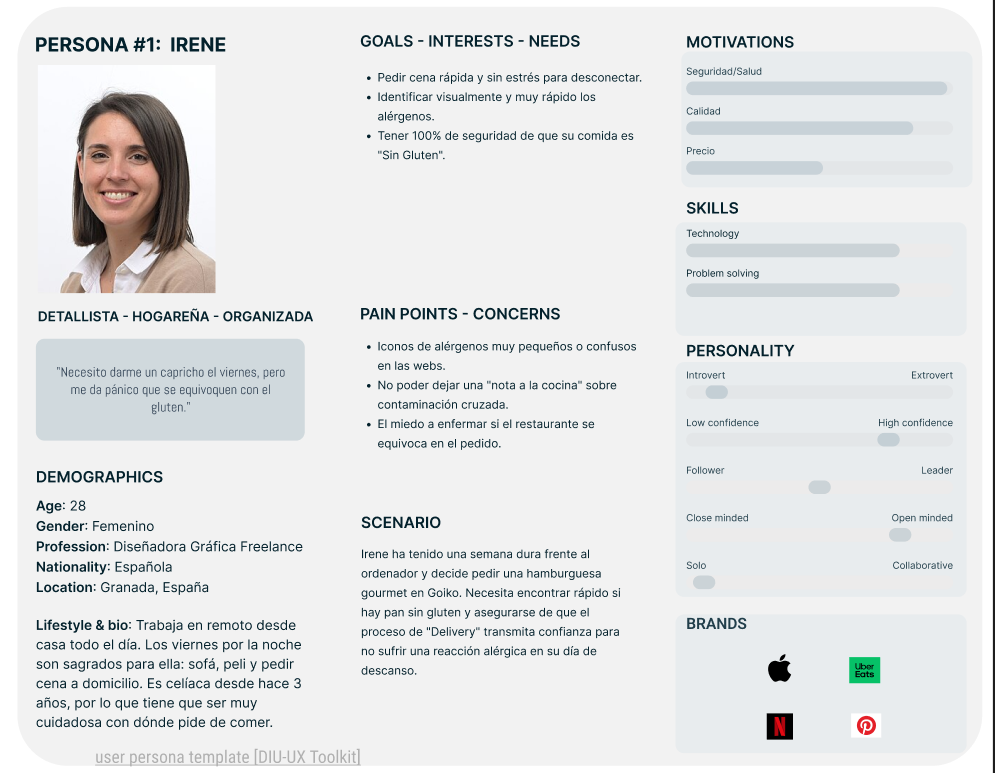

Irene (28 años) es una diseñadora gráfica local que trabaja desde casa. Le encanta pedir comida a domicilio los viernes para desconectar ("delivery"). Hemos elegido a este perfil porque es celíaca. Representa al usuario que necesita **información de alérgenos** urgente. Su mayor miedo al usar la web de Goiko es no encontrar la opción de "pan sin gluten" o no poder dejar una nota al restaurante sobre la contaminación cruzada al hacer su pedido.

* [📄 Ver nuestra persona Irene](./P1/foto_ficha_persona1.png)

  

**Persona 2: Pedro, el organizador Erasmus**  

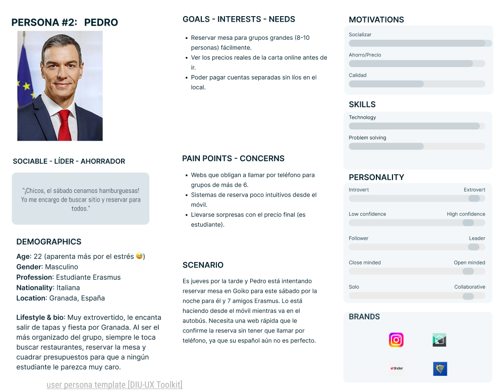

Pedro (22 años) es un estudiante italiano de Erasmus en Granada. Es muy social y siempre le toca organizar las cenas de su grupo. Hemos elegido a este perfil porque representa al usuario que necesita usar el **sistema de reservas** de la web. Su principal frustración es no poder ver rápido la disponibilidad para grupos grandes y no entender si puede separar la cuenta, ya que su presupuesto de estudiante es ajustado. Puede que en la imagen, no aparente la edad que tiene, pero es debido a su enorme frustación lo que le hace parecer mayor.

* [📄 Ver nuestra persona Pedro](./P1/foto_ficha_persona2.png)

  

### 1.d User Journey Map
 
----

Para crear nuestros mapas de experiencia, hemos diseñado dos escenarios que son tremendamente habituales en el día a día de una hamburguesería como Goiko. Hemos puesto a nuestros usuarios a intentar cumplir sus objetivos principales para ver dónde la web les ayuda y dónde les genera frustración.

 

**Journey 1: Irene y el pedido a domicilio sin gluten**  

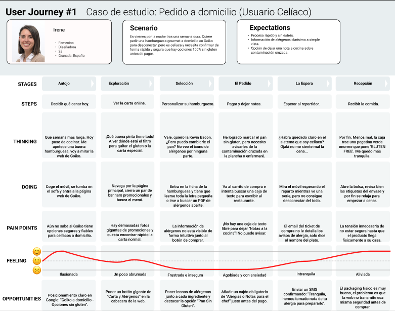

Irene intenta pedir una cena a domicilio un viernes por la noche. Hemos elegido esta experiencia porque el "delivery" es uno de los servicios más usados en Goiko. Es una situación muy realista y común: un usuario con restricciones alimentarias (celiaquía) que necesita seguridad. En su viaje, vemos cómo la emoción de Irene cae en picado al darse cuenta de que la información de alérgenos no está clara durante el proceso de compra y no tiene un campo de texto libre para avisar a la cocina, generándole mucha ansiedad.

* [📄 Ver nuestro journey de Irene](./P1/foto_viaje_persona1.png)

  

**Journey 2: Pedro y la reserva para un grupo grande**  

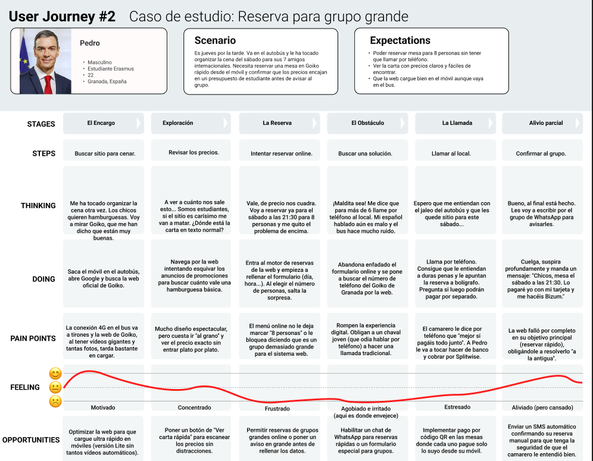

Pedro intenta reservar una mesa para 8 personas un sábado por la noche. Hemos elegido esta experiencia porque las cenas de grupos de jóvenes y estudiantes son un pilar básico de este tipo de restaurantes. Es un caso de uso súper habitual. En su viaje, vemos cómo Pedro se frustra porque el sistema de reservas le pone trabas para grupos grandes, obligándole a dar vueltas por la web buscando un teléfono o intentando descifrar si en el local les dejarán pagar por separado.

* [📄 Ver nuestro journey de Pedro](./P1/foto_viaje_persona2.png)

  

### 1.e Usability Review
 
----

Para terminar esta primera fase, hemos evaluado la web oficial de Goiko usando una plantilla de revisión de usabilidad (Checklist). Esto nos sirve para ponerle una "nota" objetiva a la página y ver exactamente en qué apartados técnicos y de diseño flaquea.

* **Enlace al documento:** [📄 Ver revisión de usabilidad de Goiko](./P1/Revision_Usabilidad.pdf)
* **URL evaluada:** https://www.goiko.com
* **Valoración numérica:** 65 / 100 (Riesgo moderado / Bueno)

 

**Comentario sobre la revisión:**

Al hacer el análisis detallado, nos hemos dado cuenta de que la web de Goiko tiene bastantes "luces y sombras":

* **Puntos fuertes:** Visualmente es espectacular y cumple muy bien su objetivo de dar hambre. Las fotos son de altísima calidad, la marca tiene muchísima personalidad y es un puntazo que tengan su propio sistema integrado para pedir a domicilio y reservar, sin depender siempre de apps externas.

 
  
* **Puntos débiles:** Tanta foto gigante, animaciones y vídeos hacen que la web cargue lenta en móviles si no tienes buena cobertura. Además, peca de querer enseñarte demasiadas promociones (pop-ups) de golpe, lo que marea un poco. Lo que más le penaliza la nota es que la información crucial, como los alérgenos o el teléfono de contacto para problemas, está demasiado escondida. En resumen: es muy bonita, pero a veces poco práctica si el usuario va con prisas.

  

### 1.f Conclusión 
----

Como consultores expertos en Experiencia de Usuario (UX), hemos realizado una auditoría integral del sitio web oficial de Goiko. Nuestra evaluación concluye que, si bien la plataforma destaca por un diseño visualmente espectacular y una identidad de marca sobresaliente (obteniendo una puntuación general de usabilidad de 65/100), presenta deficiencias significativas en rendimiento, flexibilidad y control del usuario.

El análisis revela que la interfaz está fuertemente orientada al marketing puro, priorizando imágenes y vídeos de altísima resolución. Esto penaliza severamente los tiempos de carga en dispositivos móviles con conexiones estándar, frustrando a usuarios en movimiento. Además, la atención del usuario compite constantemente contra una sobrecarga de pop-ups y banners promocionales.

Mediante el modelado de usuarios (Personas) y mapas de experiencia (Journey Maps), hemos detectado "puntos de dolor" críticos al salir del flujo ideal (Happy Path). El motor de reservas es excesivamente rígido: bloquea solicitudes de grupos grandes sin ofrecer alternativas digitales, rompiendo la experiencia y obligando al usuario a recurrir a la llamada telefónica tradicional. Por otro lado, el proceso de pedido a domicilio falla en un aspecto vital como es la salud. La ausencia de filtros rápidos de alérgenos y la imposibilidad de dejar notas abiertas a la cocina genera gran ansiedad e inseguridad en clientes con restricciones alimentarias.

En conclusión, Goiko.com es un producto digital estéticamente brillante, pero necesita evolucionar hacia un enfoque verdaderamente centrado en el usuario (User-Centric). Recomendamos aligerar la carga multimedia, dotar de flexibilidad a los formularios e implementar flujos de ayuda más accesibles.

    

## Paso 2. UX Design  

### 2.a Reframing / Ideacion: Feedback Capture Grid / Empathy Map 
 
----

A modo de conclusión de la práctica anterior, observamos que competidores locales como *Sancho Casual Burger* ofrecen plataformas funcionales pero extremadamente monótonas ("añadir al carrito y pagar"). El sector carece de innovación y gamificación en la experiencia de compra. Para estructurar nuestro rediseño, primero analizamos a nuestros usuarios tipo (Mapa de Empatía) y luego recogemos los hallazgos técnicos (Malla Receptora).

 

#### Empathy Map de nuestros Usuarios

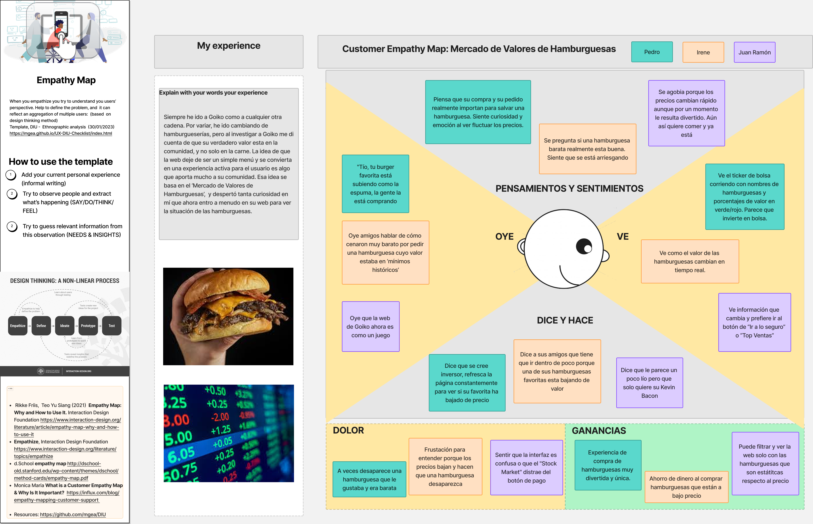

* [📄 Ver nuestro Empathy Map de Usuarios](./P2/Empathymap.png)

 

#### Feedback Capture Grid (Malla Receptora)

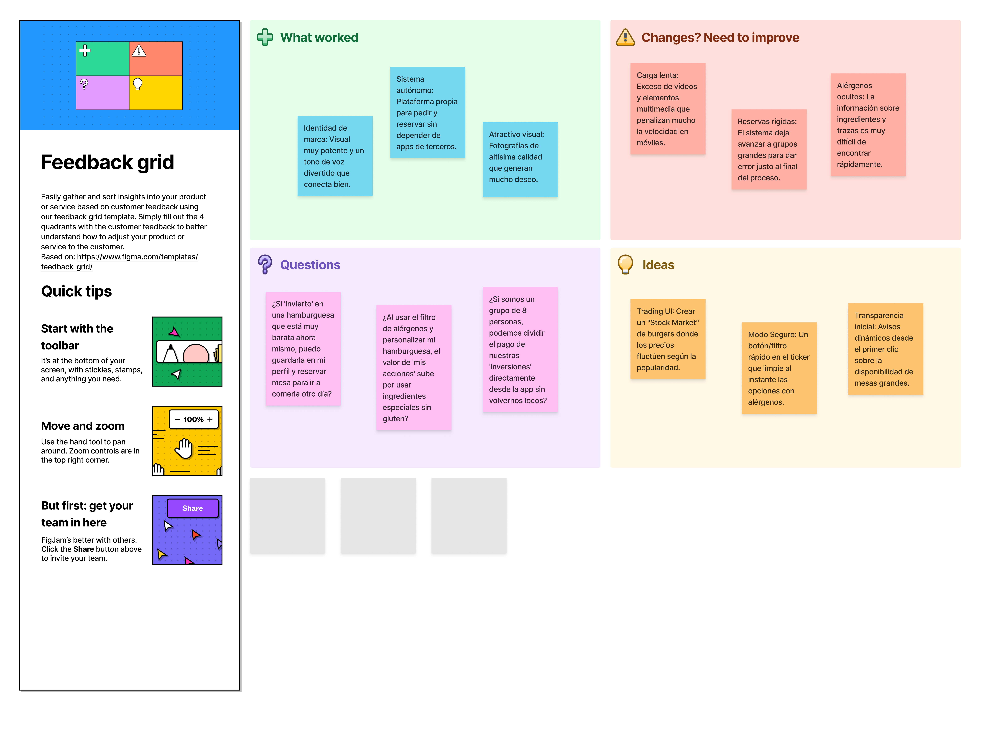

* [📄 Ver nuestro Feedback Capture Grid](./P2/FeedbackCaptureGrid.png)

 

#### Problema e Hipótesis (Propuesta de Valor)

**El Problema:**
La plataforma actual de Goiko es visualmente espectacular, pero estática, pesada y frustrante para usuarios con necesidades específicas (dietas restrictivas o gestión de grupos). Además, la experiencia de pedir comida a domicilio se ha estandarizado tanto en la competencia que ha perdido el factor sorpresa, lo que dificulta dar salida a los productos menos populares del menú y no genera un *engagement* real con el público joven y digital.

**Nuestra Hipótesis (Goiko's Change made by Compis):**
Creemos que transformando la experiencia de compra tradicional en un entorno interactivo y gamificado inspirado en el mercado de valores (*Trading UI*), lograremos aumentar masivamente la retención del usuario. Al hacer que los precios fluctúen en tiempo real para "salvar" las hamburguesas menos demandadas (botón "Invertir"), incentivamos la exploración del menú. Si acompañamos esta interfaz divertida con una arquitectura técnica limpia, flujos de reserva transparentes desde el primer clic y filtros de alérgenos accesibles, mejoraremos la usabilidad general del servicio fusionando eficacia con entretenimiento.

  

### 2.b ScopeCanvas

----

Mediante el uso de ScopeCanvas mostramos nuestra propuesta de valor mediante su propósito, necesidades, objetivos, acciones y métricas:

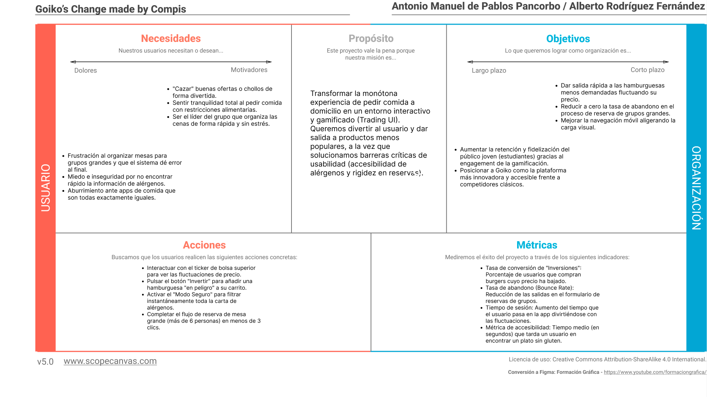

* [📄 Ver nuestro ScopeCanvas](./P2/ScopeCanvas.png)

  

### 2.c User Flow (task) Analysis 
----

#### User map
| Tarea | Usuario Invitado | Cliente Registrado | Administrador    
| ------------- | ------- | ------- | ------- |
| **Ver Ticker de bolsa en vivo** | Alta | Alta | Media |
| **Registrarse** | Alta | - | Alta |
| **Iniciar sesión** | - | Alta | Alta |
| **Consultar carta clásica (precios fijos)** | Alta | Alta | Baja |
| **Invertir / Comprar Burger (Mercado)** | Media | Alta | Baja |
| **Reservar mesa y "Congelar" precio** | Media | Alta | Baja |
| **Añadir al Carrito** | Alta | Alta | Baja |
| **Gestionar "Mi Cartera" (Alertas)** | - | Media | Baja |

*-Nota: En los task flow el hecho de haber iniciado sesión o no, no es relevante por lo que se omite para simplificar el diagrama. El usuario puede navegar y comprar/reservar sin estar registrado.*

 

#### 1. Task flow: Reserva de mesa con precio congelado

- Este flujo describe el proceso desde que se entra en el mercado de hamburguesas para ver sus precios y
  se termina reservando una mesa para un día concreto y así congelar el precio de la hamburguesa para ese día

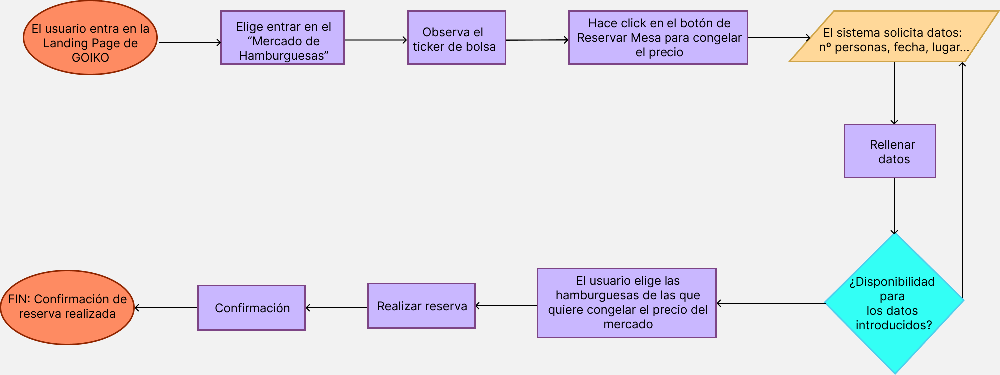 

* [📄 Ver nuestro UserFlowBookTable](./P2/UserFlowBookTable.png) 

 

#### 2. Task flow: Inversión en Hamburguesa

- Este flujo describe el proceso desde que el usuario detecta una oportunidad en el Mercado de hamburguesas hasta que confirma su compra (la de una hamburguesa con precio variable)

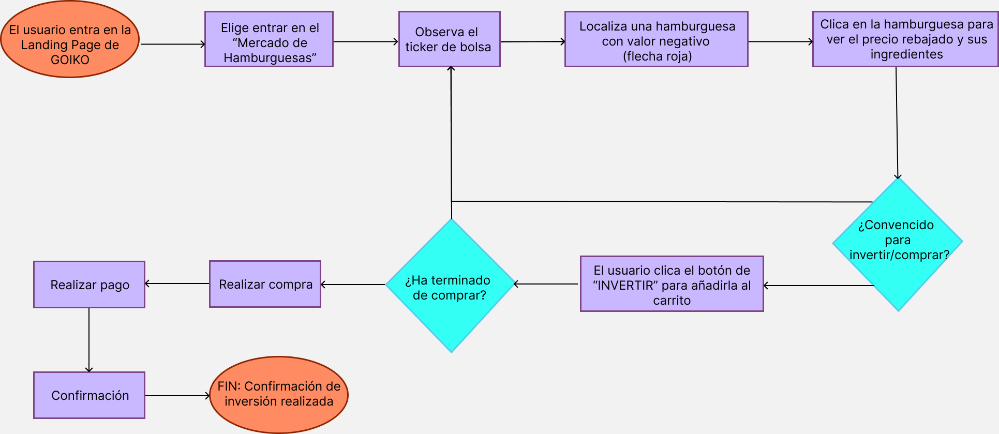 

* [📄 Ver nuestro UserFlowBookTable](./P2/UserFlowInvestBurger.png) 

  

### 2.d IA: Sitemap + Labelling 
----

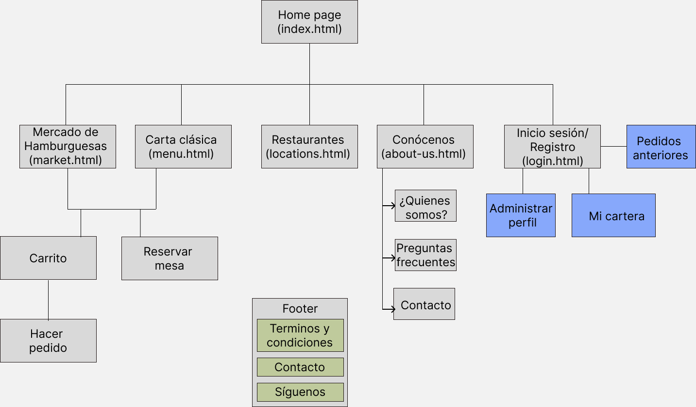 

* [📄 Ver nuestro SiteMap](./P2/Sitemap.png)

 

Término | Significado     
| ------------- | ------- |
| **Home page** | Punto de entrada principal. Presenta el "Ticker" en vivo con las variaciones de precios y las ofertas más destacadas. |
| **Mercado de Hamburguesas** | Panel dinámico donde los usuarios visualizan las burgers cuyo precio fluctúa según la demanda y popularidad social. |
| **Carta clásica** | Menú tradicional de Goiko. Contiene los productos icónicos con precios fijos para usuarios que buscan rapidez sin variaciones. |
| **Restaurantes** | Localizador geográfico de establecimientos físicos. |
| **Conócenos** | Sección corporativa que incluye la historia de la marca, resolución de dudas (FAQ) y canales de atención al cliente. |
| **Inicio sesión / Registro** | Portal de acceso para usuarios. Permite desbloquear las funciones de "Mi cartera", ver pedidos anteriores y administrar el perfil. |
| **Carrito** | Pasarela intermedia de revisión de productos seleccionados antes de confirmar la compra final o el envío. |
| **Reservar mesa** | Funcionalidad para asegurar sitio en el local. Para el "Mercado de Hamburguesas" permite al usuario "congelar" el precio actual de su burguer de mercado. |
| **Hacer pedido** | Flujo final de transacción para envíos a domicilio (Delivery) o recogida en local (Take Away). |
| **Administrar perfil** | Panel de configuración de datos personales, direcciones de envío y métodos de pago guardados. |
| **Mi cartera** | Espacio de fidelización donde se gestionan las alertas de precios bajos y las hamburguesas marcadas como favoritas. |
| **Pedidos anteriores** | Historial detallado de compras realizadas y seguimiento del "ahorro" obtenido al invertir en el mercado. |
| **Footer** | Pie de página con acceso directo a redes sociales (Síguenos), información legal y datos rápidos de contacto. |

  

### 2.e Wireframes
 
----

En esta sección, se podrán ver tanto los bocetos en papel como los wireframe Lo-Fi a continuación:

* [📄 Ver nuestros bocetos](./P2/Bocetos.pdf) 

 

De aquí en adelante, se encontrará los bocetos Lo-Fi:

- Wireframe de la Landing Page: 
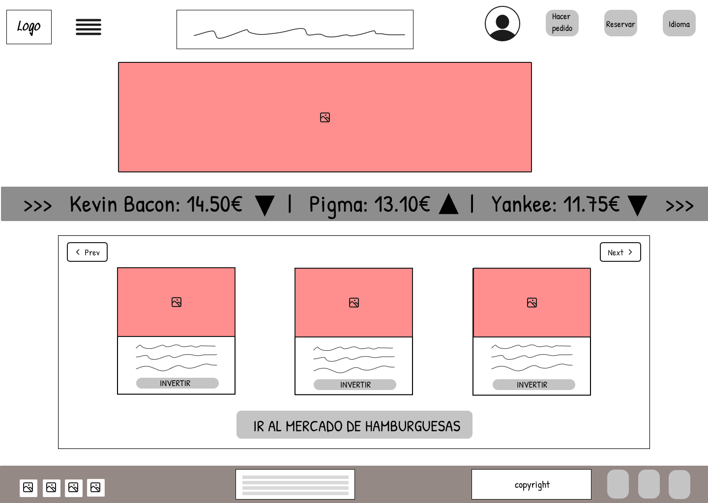

* [📄 Ver nuestro Wireframe Landing Page](./P2/WireframeLandingPage.png)

 

- Wireframe del Mercado de Hamburguesas:  

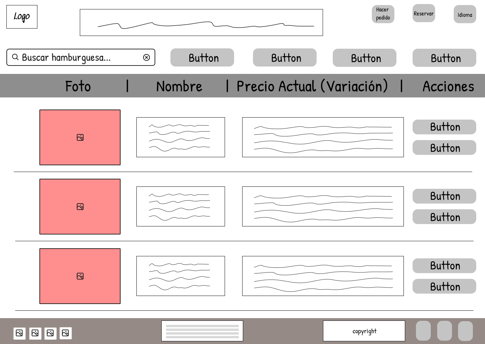

* [📄 Ver nuestro Wireframe Burger Market](./P2/WireframeBurgerMarket.png)

 

- Wireframe de Mi Cartera:  

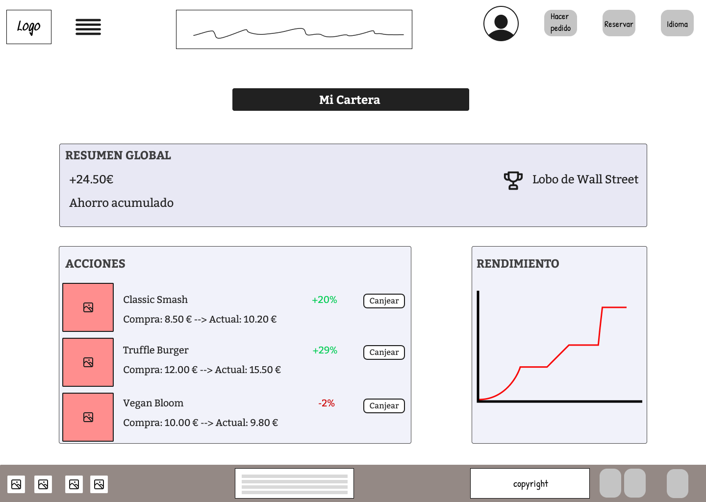

* [📄 Ver nuestro Wireframe Mi Cartera](./P2/WireframeCartera.png)

 

- Wireframe de Mi Carrito:  

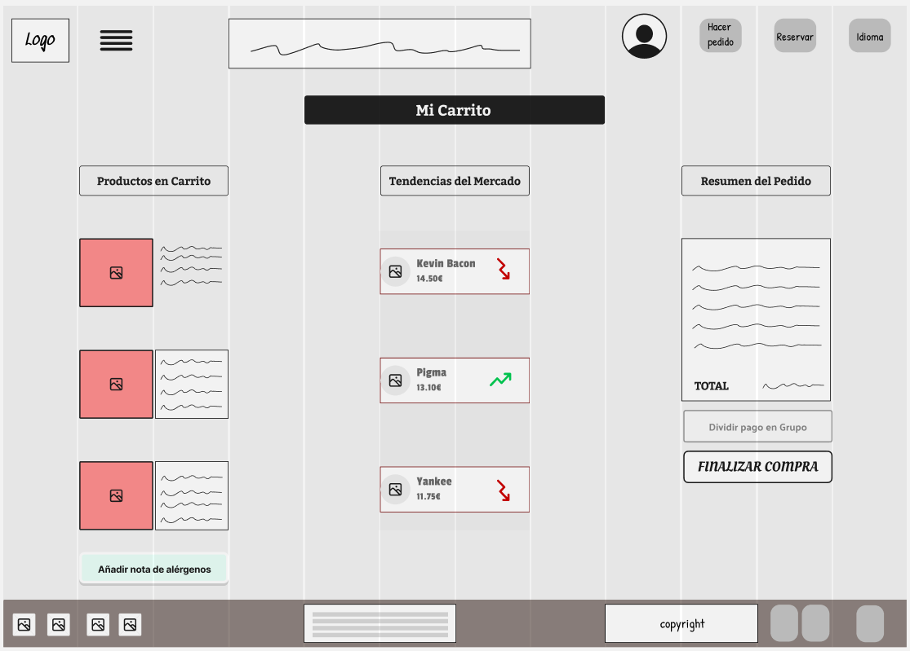

* [📄 Ver nuestro Wireframe Mi Carrito](./P2/WireframeCarrito.png)

  

### 2.f Conclusión 
----

A lo largo de esta segunda práctica, hemos logrado transformar una idea disruptiva en una arquitectura sólida y centrada en el usuario (UX). Partiendo de la investigación y empatía inicial (Empathy Map y Malla Receptora), confirmamos la necesidad de romper con la monotonía de las aplicaciones de delivery tradicionales. Esto nos llevó a consolidar nuestra propuesta de valor: gamificar la experiencia de Goiko convirtiéndola en un dinámico "Mercado de Valores".

Mediante el uso de herramientas estratégicas como el ScopeCanvas y el análisis de tareas (User Flows), hemos diseñado flujos lógicos para asegurar que mecánicas innovadoras —como "invertir" en hamburguesas cuyo precio fluctúa o "congelar" su valor al reservar una mesa— resulten naturales e intuitivas. La Arquitectura de la Información (Sitemap) nos ha permitido organizar este nuevo ecosistema de forma coherente.

Todo este trabajo se materializa en los wireframes Lo-Fi, donde hemos alcanzado un equilibrio perfecto entre la temática financiera (con elementos como el ticker en vivo, las gráficas de rendimiento en "Mi Cartera" y rangos como el Lobo de Wall Street) y la usabilidad pura. Además, el diseño integra de forma orgánica las soluciones a los pain points reales detectados en nuestros usuarios, implementando funcionalidades clave como la división de pagos en grupo y la gestión de alérgenos directamente en el carrito de compra.

En definitiva, hemos construido un esqueleto interactivo, altamente diferenciador y justificado en las necesidades del usuario, sentando las bases idóneas para afrontar con garantías la futura fase de diseño visual y prototipado de alta fidelidad (UI).

    

## Paso 3. Mi UX-Case Study (diseño)

### 3.a Moodboard

-----

 

* [📄 Ver nuestro Moodboard](./P3/Moodboard.png)

 

El moodboard de Wall Street Burgers refleja la fusión perfecta entre la elegancia de un club financiero y la indulgencia de GOIKO. Visualmente, la propuesta se apoya en una paleta que combina el ocre bronce, evocando el lujo y el pan tostado, con rojos vibrantes diseñados para alertar sobre las caídas de precios, todo sobre un fondo crema limpio. La tipografía mezcla el carácter rotundo y clásico de Oswald para los titulares, con la precisión técnica de Inter para facilitar la lectura de los valores de mercado. Todo este universo visual sirve de marco para un tono de voz de "bróker gamberro", que transforma el menú en una bolsa de valores gamificada donde el usuario entra para invertir con hambre y comerse el mercado.

  

### 3.b Guidelines
 
----

Para el desarrollo visual de *Wall Street Burgers*, hemos prescindido de frameworks rígidos y hemos optado por construir un **Design System ligero y personalizado**, enfocado en la modularidad y la escalabilidad de nuestra interfaz web.

 

#### 1. Foundations (Cimientos del Sistema)
Utilizando plugins de Figma para la generación de estilos, hemos definido nuestras bases visuales (Design Tokens):
*   **Sistema de Color:** Hemos documentado nuestra paleta en escalas (ej. `color-primary-600`), definiendo el Ocre Bronce para la identidad corporativa, el Crema como fondo neutro para evitar fatiga visual, y el Rojo Vivo como color de *feedback* y alerta para los CTAs principales y las "caídas de mercado".
*   **Arquitectura Tipográfica:** Escala modular utilizando **Oswald** para los H1-H3 (titulares llamativos) e **Inter** para el *Body* y las etiquetas de datos (garantizando legibilidad en los números cambiantes del mercado).

 

#### 2. Metodología Atomic Design
Hemos estructurado nuestros componentes de menor a mayor complejidad para facilitar el ensamblaje de los wireframes Hi-Fi:
*   **Átomos:** Elementos base indivisibles. Estilos de texto, tokens de color, iconos (flechas de tendencias, trofeos de usuario), botones simples y contenedores básicos.
*   **Moléculas:** Agrupaciones funcionales. Tarjetas de producto (Foto + Nombre + Precio + Variación + Botón), barras de búsqueda, e indicadores de rendimiento de la cartera.
*   **Organismos:** Secciones complejas como el Header de navegación, el "Ticker" dinámico de precios (el banner rojo animado), y el Footer legal.

A través del siguiente enlace, se podrá ver nuestro Diseño Atómico realizado en Figma, organizado en distintas páginas donde se pueden encontrar: átomos, moléculas, organismos y los bocetos finales.

* [🔗 Ver el proyecto interactivo directamente en Figma](https://www.figma.com/design/EcflaKpYL0jVP59BLETOzQ/Dise%C3%B1o-Sistema?m=auto&t=szcr0lgR3elgUFrY-1)

 

#### 3. Patrones de Diseño IU y Layout Web
Siguiendo las directrices de diseño web y la usabilidad en desktop, hemos aplicado los siguientes patrones:
*   **Patrón de Lectura en "F":** Hemos estructurado el layout asumiendo que el usuario escaneará la pantalla de izquierda a derecha y de arriba a abajo. Por ello, el logo y el menú principal se ubican en la esquina superior izquierda, seguido de la navegación transversal. El "Ticker" de precios capta la atención inmediatamente debajo en el primer barrido visual horizontal.
*   **Ubicación de CTAs (Call to Action):** Los botones principales de conversión (como "INVERTIR" o "FINALIZAR COMPRA") se han ubicado estratégicamente en la ruta visual del usuario, alineados a la derecha o destacados con el color de mayor contraste (Rojo Vivo) para incitar a la acción rápida, simulando la urgencia del *trading*.
*   **Header y Footer predecibles:** Para reducir la carga cognitiva frente a una propuesta tan novedosa, mantenemos la estructura clásica de navegación superior y cierre legal/social en la parte inferior.

  

### 3.c Maquetas
 
----

#### HI-FI de la Landing Page 

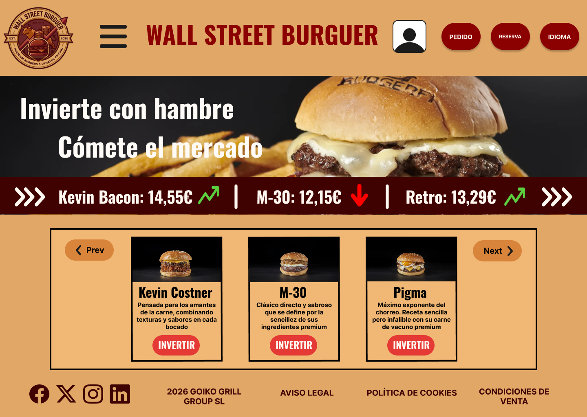

* [📄 Ver nuestro HI-FI de la Landing Page](./P3/WireframeHiFiLandingPage.png)

 

#### HI-FI del Mercado de Hamburguesas 

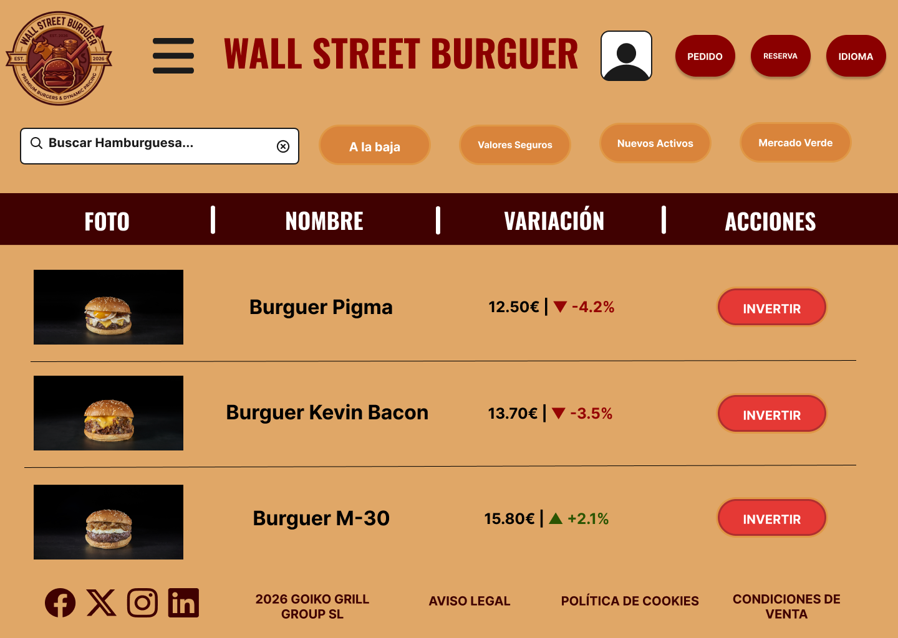

* [📄 Ver nuestro HI-FI del Burguer Market](./P3/WireframeHiFiMercadoHamburguesas.png)

 

#### HI-FI de Mi Cartera

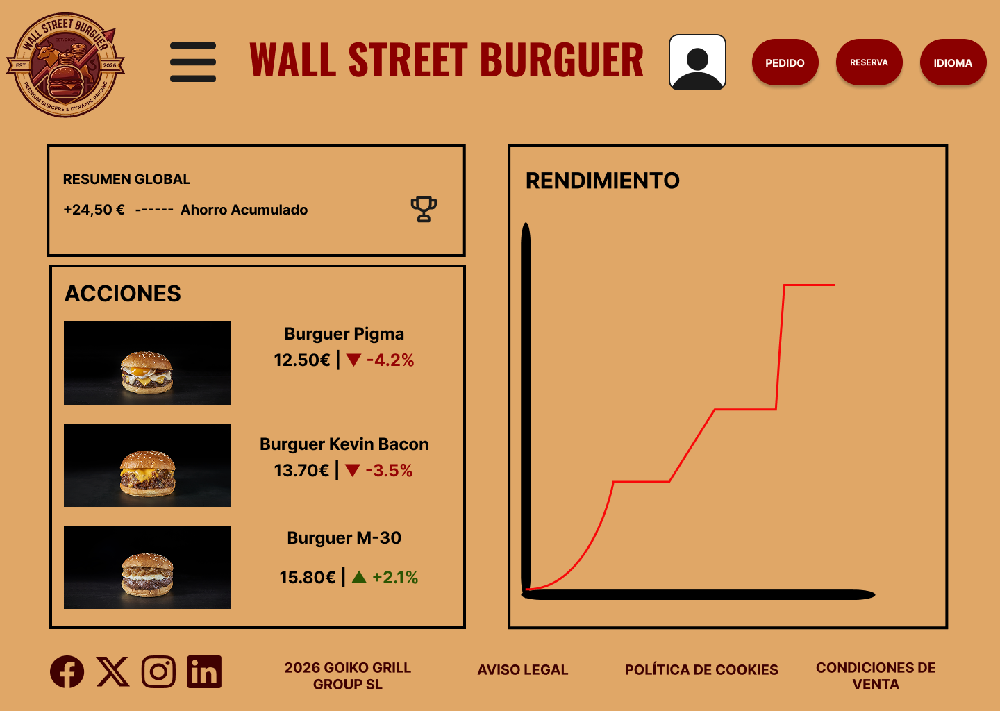

* [📄 Ver nuestro HI-FI de Mi Cartera](./P3/WireframeHifiCartera.png)

 

#### HI-FI de Mi Carrito 

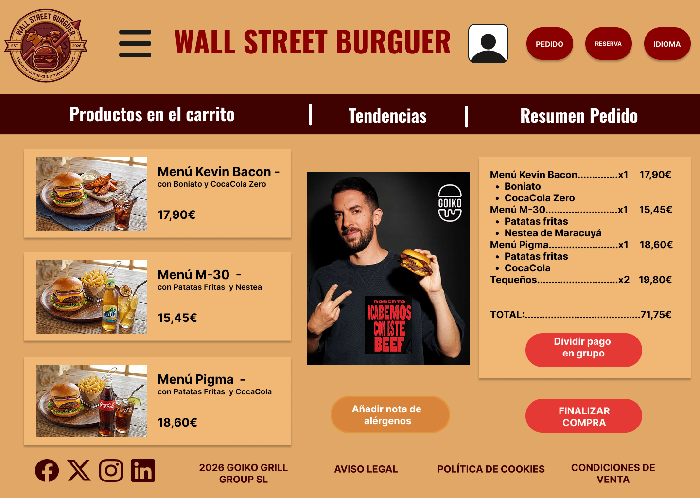

* [📄 Ver nuestro HI-FI de Mi Carrito](./P3/WireframeHifiCarrito.png)

  

### 3.d Conclusión
----

El desarrollo del prototipo Hi-Fi de *Wall Street Burgers* ha sido un reto superado con éxito gracias a la combinación de metodologías ágiles de diseño y el apoyo de herramientas de IA. 

Nuestro principal acierto ha sido la definición inicial de un **UX Writing potente** ("bróker gamberro") y un Moodboard muy claro. Esto nos permitió tomar decisiones de UI rápidas y coherentes. La interfaz destaca por su alto contraste y su capacidad de gamificar una acción tan cotidiana como pedir comida a domicilio. El uso del "Ticker" de precios y las tarjetas de fluctuación aportan un dinamismo que engancha visualmente al usuario desde el primer segundo.

El proceso se ha optimizado enormemente gracias a:
1.  Herramientas de IA Generativa:Han sido fundamentales en las fases iniciales para generar el *copywriting* motivador, afinar el tono de voz de la marca, generar las imágenes inspiracionales del moodboard y ayudarnos a traducir los conceptos financieros complejos a una interfaz de usuario comprensible.

 
 
2.  Figma + Plugins: La utilización de plugins para la generación de fundaciones (escalas de color y tipografía) y librerías como *Lucide* para la iconografía, nos ahorró horas de trabajo manual. 

 

3.  Atomic Design: Al construir primero los átomos y moléculas en Figma usando *Componentes* y *Auto Layout*, el ensamblaje final de las pantallas Hi-Fi (Landing Page, Mercado, Cartera y Carrito) fue un proceso casi automático, garantizando una consistencia visual perfecta en todo el proyecto.

 

En conclusión, la integración del diseño atómico junto con la asistencia de la IA nos ha permitido crear un prototipo robusto, visualmente impactante y listo para las siguientes fases de evaluación funcional.

    

## Paso 4. Exportación y Documentación 

### 4.a Exportación a HTML/React

**Creación de la App React con Figma Make:**
Para la conversión de nuestro diseño visual a código interactivo, hemos optado por la alternativa basada en **Figma Make (IA)**. Este proceso ha permitido migrar el contenido de "Wall Street Burgers" directamente a un entorno de desarrollo moderno sin la necesidad de maquetación manual de átomos y moléculas.

La herramienta procesó nuestros archivos de diseño y generó una estructura completa basada en **Vite y React**. Es destacable que el código resultante utiliza **Tailwind CSS** y componentes de **Radix UI**, garantizando que la aplicación sea no solo visualmente fiel, sino también accesible y técnica conforme a los estándares actuales. Tras la generación, exportamos el proyecto e inicializamos el entorno local en Visual Studio Code mediante `npm install`, verificando que la arquitectura de carpetas y las rutas de navegación (`App.tsx`) funcionaban correctamente.

  

### 4.b Despliegue y Publicación

**Proceso de Despliegue:**
De acuerdo con las facilidades de la opción elegida, el despliegue se ha realizado a través de la plataforma de alojamiento propia de Figma Make. Esto ha simplificado el flujo de trabajo al obtener un dominio estable y seguro de forma inmediata, permitiendo una evaluación directa de la interactividad del producto final en la web.

* 🔗 **Enlace para la evaluación:** [Ver aplicación de Wall Street Burgers en Figma Make](https://www.figma.com/make/RNMefk5sTP5USA9a05kYDV/Crear-aplicaci%C3%B3n-dise%C3%B1o-at%C3%B3mico?t=fy4pVEjMTT9vtP7p-1&preview-route=%2Fcart)

  

### 4.c Conclusión

**Elementos de diseño mantenidos:**
La migración ha sido exitosa al mantener la **fidelidad 1:1 de los estilos visuales** (paleta de colores corporativa, tipografías e iconografía de Lucide), el **layout basado en Auto Layout** de Figma (que se tradujo correctamente a Flexbox/Grid en Tailwind) y los **estados de los componentes**, asegurando que la experiencia de usuario diseñada originalmente se traslade al producto funcional.

**Proceso de producción y problemas detectados:**
El proceso de producción fue altamente eficiente, aunque requirió una fase de supervisión y refinamiento mediante prompts de IA. Detectamos y corregimos problemas menores relacionados con la accesibilidad (como avisos de *warnings* en componentes de Radix UI y descripciones faltantes en menús laterales) y la gestión de referencias (`forwardRef`). La estrategia adoptada fue utilizar el agente de IA para iterar sobre estos errores hasta obtener un código limpio y libre de advertencias en la consola del navegador.

Esta práctica ha demostrado que la adopción de flujos de trabajo impulsados por IA permite al equipo centrarse en la experiencia de usuario y la arquitectura de la información, delegando la maquetación base y obteniendo un "esqueleto" en React profesional y escalable.

    

## Paso 5. Pruebas de Evaluación 

### 5.a Reclutamiento de usuarios

-----

**Descripción del Caso B (La Qarmita):**
El Caso B asignado para la evaluación cruzada es una plataforma digital diseñada para trasladar la experiencia de "ocio lento" de La Qarmita (un espacio híbrido que une cafetería y librería en Granada) al entorno online. Su objetivo es crear una web intuitiva que elimine las fricciones actuales del negocio físico, integrando una carta gastronómica digital accesible, una tienda de libros optimizada con filtros, un sistema de gestión y reserva de eventos culturales, y un foro de reseñas para fomentar la comunidad lectora.
* **Enlace al repositorio (Caso B):** [https://github.com/tomaas05/UrsMas-Repo](https://github.com/tomaas05/UrsMas-Repo)

**Estrategia de reclutamiento:**
Siguiendo las directrices del muestreo mixto, se han reclutado 10 usuarios en total: 3 de ellos mediante co-evaluación (compañeros de clase) y 7 usuarios externos para garantizar la diversidad. Se han distribuido equitativamente (5 para el Caso A y 5 para el Caso B) y se han anonimizado mediante identificadores (P01 - P10).

**Tabla de Participantes:**

| ID | Sexo/Edad | Ocupación | Exp.TIC | Personalidad | Plataforma | Caso |
| :--- | :--- | :--- | :--- | :--- | :--- | :--- |
| **P01** | H / 21 | Estudiante (Clase) | Alta | Analítico | Web (PC 15") | A (Wall Street Burgers) |
| **P02** | M / 22 | Estudiante (Clase) | Alta | Perfeccionista| Web (PC 14") | A (Wall Street Burgers) |
| **P03** | H / 20 | Estudiante (Clase) | Alta | Impaciente | Web (PC 15") | A (Wall Street Burgers) |
| **P04** | M / 45 | Administrativa | Media | Pragmática | Web (PC 15") | A (Wall Street Burgers) |
| **P05** | H / 58 | Profesor | Baja | Cauto | Web (Tablet) | A (Wall Street Burgers) |
| **P06** | M / 24 | Diseñadora Gráfica | Alta | Creativa | Web (PC 24") | B (La Qarmita) |
| **P07** | H / 30 | Ingeniero | Alta | Directo | Web (PC 15") | B (La Qarmita) |
| **P08** | M / 62 | Jubilada | Baja | Paciente | Web (Tablet) | B (La Qarmita) |
| **P09** | H / 19 | Estudiante | Media | Impulsivo | Web (PC 13") | B (La Qarmita) |
| **P10** | M / 35 | Abogada | Media | Ocupada | Web (PC 15") | B (La Qarmita) |

**Condiciones de Eye Tracking y Factores Técnicos:**
Para los usuarios sometidos a seguimiento ocular (Eye Tracking con GazeMapping) en el Caso B, se han registrado los siguientes parámetros ambientales y físicos:
* **P06:** Usa gafas (se ajustó la cámara para evitar reflejos). Iluminación natural. Monitor 24".
* **P07:** Sin gafas ni lentillas. Luz artificial tenue. Portátil 15".
* **P09:** Usa lentillas (sin alteraciones en la pupila). Luz natural. Portátil 13".

**Situaciones conflictivas y sesgos esperados:**
* **Usuarios con Exp. TIC Baja (P05, P08):** Pueden presentar dificultades para identificar botones con bajo contraste o para comprender flujos de navegación que requieran varios pasos (como el proceso de reserva de eventos culturales).
* **Usuarios Impacientes (P03, P09):** Alta probabilidad de abandono de la tarea si la jerarquía visual no guía rápidamente hacia el "Call to Action" (CTA) principal o a la tienda de libros.
* **Resolución de pantalla (P09 frente a P06):** Al utilizar un portátil de 13", P09 requerirá mayor uso del *scroll* vertical, lo que podría desplazar elementos clave (como la carta gastronómica o los filtros de libros) fuera del primer impacto visual en comparación con el monitor de 24" de P06.

  

### 5.b Diseño de las pruebas

-----

Las pruebas de usabilidad se desarrollarán combinando interacción real guiada por tareas, análisis biométrico y medición de la percepción subjetiva. Se plantea un estudio *Between-Subjects* (entre-sujetos) donde cada participante evaluará únicamente uno de los casos (A: Wall Street Burgers o B: La Qarmita), ejecutando el siguiente protocolo de evaluación:

**1. Interacción Real y A/B Testing**
Se establecerán escenarios de uso con tareas clave específicas para cada diseño, evaluando la eficacia, la facilidad de navegación y midiendo la tasa de éxito (con o sin asistencia) en sesiones de 5 a 10 minutos.
* **Tareas Caso A (Wall Street Burgers):** Simular la personalización de un pedido en la carta digital y localizar la información de contacto o ubicación del local.
* **Tareas Caso B (La Qarmita):** Consultar la carta gastronómica, utilizar los filtros del catálogo para buscar un libro específico y simular la reserva de plaza para un evento cultural de la agenda.

**2. Eye Tracking (GazeMapping)**
Para analizar la jerarquía visual y la capacidad de la interfaz para guiar la atención del usuario, se empleará la herramienta de desarrollo propio **GazeMapping** en un entorno de instalación local.
* **Preparación:** Se rasterizarán 2-3 páginas principales de cada diseño utilizando la extensión *FireShot*.
* **Configuración:** Se definirán Puntos de Interés (POI) estratégicos en ambos casos, tales como los *Call to Actions* (CTAs de reserva o compra), el logotipo y el menú de navegación principal.
* **Ejecución:** Se realizarán sesiones de exploración guiada y navegación libre para extraer mapas de calor (*heatmaps*) que permitan identificar qué elementos captan la atención y cuáles pasan desapercibidos.

**3. Test SUS (System Usability Scale)**
Inmediatamente después de finalizar las tareas de interacción, se administrará el cuestionario estandarizado SUS mediante un formulario digital alojado en **Tally.so**. 
* El cuestionario recogerá las variables demográficas y las 10 preguntas estándar de percepción subjetiva. 
* Posteriormente, los archivos JSON generados se exportarán e introducirán en **sus.tools** y **sus.mixality.de** para realizar un análisis multivariable y comparar numéricamente ambos diseños.

**4. Evaluación de Usabilidad y Accesibilidad**
Como complemento a las métricas anteriores y retomando los principios evaluados en el checklist de la P1, se ha incorporado una auditoría técnica de accesibilidad para el Caso B. Utilizando la herramienta **WAVE**, se evalúan aspectos perceptibles, operables y comprensibles para asegurar el cumplimiento del estándar normativo WCAG (contraste, etiquetas estructuradas y alternativas textuales).

  

### 5.c Cuestionario SUS
 
----

**Respuestas de los Usuarios - Caso A (Wall Street Burgers)**

| Preguntas | P01 | P02 | P03 | P04 | P05 |
| :--- | :--- | :--- | :--- | :--- | :--- |
| **1.** Creo que me gustará visitar con frecuencia este website | 4 | 5 | 3 | 4 | 3 |
| **2.** Encontré el website innecesariamente complejo | 1 | 2 | 2 | 2 | 3 |
| **3.** Pensé que era fácil utilizar este website | 5 | 4 | 4 | 4 | 3 |
| **4.** Creo que necesitaría del apoyo de un experto para recorrer el website | 1 | 1 | 2 | 1 | 3 |
| **5.** Encontré las funciones del website bastante bien integradas | 4 | 5 | 3 | 4 | 4 |
| **6.** Pensé que había demasiada inconsistencia en el website | 2 | 1 | 3 | 2 | 2 |
| **7.** Imagino que la mayoría de las personas aprenderían muy rápidamente... | 5 | 4 | 4 | 4 | 3 |
| **8.** Encontré el website muy grande al recorrerlo | 1 | 2 | 2 | 1 | 2 |
| **9.** Me sentí muy confiado en el manejo del website | 4 | 4 | 3 | 4 | 3 |
| **10.** Necesito aprender muchas cosas antes de manejarme en el website | 1 | 1 | 2 | 2 | 3 |

**Respuestas de los Usuarios - Caso B (La Qarmita)**

| Preguntas | P06 | P07 | P08 | P09 | P10 |
| :--- | :--- | :--- | :--- | :--- | :--- |
| **1.** Creo que me gustará visitar con frecuencia este website | 5 | 4 | 3 | 4 | 5 |
| **2.** Encontré el website innecesariamente complejo | 2 | 2 | 4 | 3 | 2 |
| **3.** Pensé que era fácil utilizar este website | 4 | 4 | 2 | 3 | 4 |
| **4.** Creo que necesitaría del apoyo de un experto para recorrer el website | 1 | 2 | 4 | 2 | 1 |
| **5.** Encontré las funciones del website bastante bien integradas | 4 | 4 | 3 | 4 | 5 |
| **6.** Pensé que había demasiada inconsistencia en el website | 2 | 2 | 3 | 3 | 2 |
| **7.** Imagino que la mayoría de las personas aprenderían muy rápidamente... | 5 | 4 | 2 | 4 | 4 |
| **8.** Encontré el website muy grande al recorrerlo | 2 | 2 | 4 | 3 | 2 |
| **9.** Me sentí muy confiado en el manejo del website | 4 | 4 | 2 | 3 | 4 |
| **10.** Necesito aprender muchas cosas antes de manejarme en el website | 1 | 2 | 4 | 2 | 2 |

#### Resultados y Análisis

A partir de las respuestas obtenidas en Tally.so y analizadas mediante *sus.tools*:

| Usuario | Caso Evaluado | Puntuación SUS |
| :--- | :--- | :--- |
| **P01** | A (Wall Street Burgers) | 80.0 |
| **P02** | A (Wall Street Burgers) | 87.5 |
| **P03** | A (Wall Street Burgers) | 65.0 |
| **P04** | A (Wall Street Burgers) | 80.0 |
| **P05** | A (Wall Street Burgers) | 57.5 |
| **P06** | B (La Qarmita) | 85.0 |
| **P07** | B (La Qarmita) | 75.0 |
| **P08** | B (La Qarmita) | 32.5 |
| **P09** | B (La Qarmita) | 62.5 |
| **P10** | B (La Qarmita) | 82.5 |

**Promedio por caso:**
* **Caso A (Wall Street Burgers):** 74.00
* **Caso B (La Qarmita):** 67.50

**Interpretación según la escala de referencia del SUS:**
El **Caso A (Wall Street Burgers)** obtiene una media de **74.00**, situándose en la categoría de experiencia **Buena / Aceptable**. La plataforma cumple de manera eficiente su función principal, logrando altas puntuaciones en usuarios con competencia digital media/alta. Sin embargo, el promedio se ve ligeramente penalizado por el usuario P05 (competencia baja), quien encontró ciertas barreras en el proceso de pedido.

El **Caso B (La Qarmita)** obtiene una media de **67.50**, rozando el límite de la categoría **Aceptable / Marginal**. Aunque los usuarios con un perfil más técnico (P06, P10) valoraron muy positivamente la integración de funciones, el diseño sufre una penalización drástica por parte del usuario P08 (perfil senior, competencia baja), quien encontró el sistema de reservas y filtros excesivamente complejo. Asimismo, P09 vio mermada su experiencia por la adaptación a una pantalla más pequeña (13").

#### Valoración personal
Los resultados cuantitativos reflejan una victoria para el Caso A en términos de usabilidad directa, pero la realidad es algo más compleja si analizamos el contexto.

El Caso A (Wall Street Burgers) es una web transaccional muy directa. Desde la perspectiva del *Customer Journey*, el embudo de conversión para hacer un pedido está muy bien definido, lo que minimiza la carga cognitiva del usuario. Al ser un producto con un objetivo único y claro, es lógico que obtenga una puntuación SUS más alta, ya que genera menos fricciones en la navegación rápida.

Por el contrario, el Caso B (La Qarmita) asume un reto mucho mayor: unificar la carta gastronómica, la venta de libros y la gestión de eventos en una sola plataforma. Esto requiere una arquitectura de la información mucho más densa. Aunque su nota final es más baja debido a la frustración de perfiles menos digitalizados, considero que es una propuesta más completa a nivel funcional. El reto principal para el Caso B de cara a futuras iteraciones sería optimizar la jerarquía visual de los filtros y simplificar los primeros pasos del usuario para evitar altas tasas de abandono.

  

### 5.d A/B Testing
 
-----

Para la evaluación del A/B Testing, se plantearon sesiones de 5 a 10 minutos por usuario. La prueba fue supervisada mediante observación directa (o compartiendo pantalla) para anotar si los participantes requerían ayuda durante la interacción.

#### Test A – Wall Street Burgers (Nuestra propuesta)
**Foco:** Landing Page y Carrito de la compra.
**Tareas:**
1. Explorar la *Landing Page* para conocer la oferta principal de hamburguesas.
2. Seleccionar un producto específico desde la página de inicio y añadirlo al pedido.
3. Acceder al **Carrito**, simular la personalización de ingredientes (ej. quitar cebolla) y localizar el botón de finalizar compra.

**Feedback recogido:**
* **Opinión general media: 6.0 / 7**
* **Interacción:** El flujo de navegación es extremadamente lineal y predecible. La gran mayoría de los usuarios (P01, P02, P04) completaron la tarea en menos de 3 minutos sin asistencia.
* **Puntos de fricción:** El usuario con menor experiencia (P05) requirió una ligera indicación visual ("supervisión leve") para encontrar el icono del carrito tras añadir el producto, ya que esperaba un *pop-up* emergente automático.

#### Test B – La Qarmita (Propuesta Alternativa)
**Foco:** Landing Page y Foro de Comentarios.
**Tareas:**
1. Navegar por la *Landing Page* para comprender el concepto de "ocio lento" (cafetería + libros).
2. Localizar el menú de navegación para explorar la agenda o la carta.
3. Encontrar el **Foro de reseñas/comunidad**, leer un comentario de otro usuario e identificar cómo dejar una opinión propia.

**Feedback recogido:**
* **Opinión general media: 5.2 / 7**
* **Interacción:** Diseño visualmente muy atractivo ("aesthetic") que transmite a la perfección la identidad de la cafetería. Los perfiles jóvenes (P06, P10) navegaron por el foro sin problemas.
* **Puntos de fricción:** El usuario en pantalla pequeña (P09) tuvo que hacer mucho *scroll* en la Landing Page, perdiendo visibilidad del foro. Por otro lado, la usuaria senior (P08) necesitó asistencia directa para entender cómo funcionaba la sección de reseñas, sintiéndose abrumada por la cantidad de texto e imágenes.

#### Resultados Cuantitativos (Escala 1 al 7)

*Nota: P01 a P05 evaluaron el Caso A. P06 a P10 evaluaron el Caso B.*

| Preguntas | P01 (A) | P02 (A) | P03 (A) | P04 (A) | P05 (A) | P06 (B) | P07 (B) | P08 (B) | P09 (B) | P10 (B) |
| :--- | :--- | :--- | :--- | :--- | :--- | :--- | :--- | :--- | :--- | :--- |
| **1. ¿Cómo calificarías tu experiencia general usando la web?** | 6 | 7 | 5 | 6 | 4 | 6 | 5 | 3 | 5 | 6 |
| **2. ¿Encontraste lo que buscabas fácilmente (carrito/foro)?** | 7 | 6 | 5 | 6 | 4 | 5 | 5 | 2 | 4 | 6 |
| **3. ¿Recomendarías esta web a otras personas?** | 6 | 6 | 5 | 5 | 5 | 7 | 5 | 3 | 5 | 6 |
| **4. ¿La aplicación te resultó atractiva visualmente?** | 5 | 6 | 5 | 5 | 5 | 7 | 6 | 5 | 6 | 7 |

#### Conclusión del A/B Testing

A partir de los resultados obtenidos de la observación y las métricas directas, el resultado agregado global determina que **el Caso A (Wall Street Burgers) es más usable.**

**Justificación:**
El **Caso A** presenta un modelo mental de *e-commerce* clásico. Al tener un objetivo único y directo (comprar comida), los usuarios no sufren pérdida de orientación. La transición entre la Landing Page y el Carrito es fluida, lo que se traduce en una mayor tasa de éxito independiente del nivel de competencia digital del usuario.

Por su parte, el **Caso B (La Qarmita)** es netamente superior en **atractivo visual y diseño estético** (como reflejan las puntuaciones de la pregunta 4), generando una gran conexión emocional. Sin embargo, su usabilidad se ve comprometida al intentar integrar demasiadas opciones (carta, eventos, libros y foro) en la misma estructura. Esto generó fricción en la búsqueda de elementos específicos (como el foro) obligando a los usuarios con menor pericia tecnológica a requerir ayuda, lo que disminuye su eficiencia global.

  

### 5.e Aplicación del método Eye Tracking 

----

>>> Indica cómo se diseña el experimento y se reclutan los usuarios. Explica la herramienta / uso de gazerecorder.com u otra similar. Aplíquese únicamente al caso B.

  
>>> Cambiar esta img por una de vuestro experimento. El recurso deberá estar subido a la carpeta P4/  

>>> gazerecorder en versión de pruebas puede estar limitada a 3 usuarios para generar mapa de calor (crédito > 0 para que funcione) 

  

### 5.f Evaluación de Accesibilidad
-----

Este apartado resume la evaluación técnica preliminar realizada sobre la aplicación del **Grupo B** (La Qarmita). El informe completo de usabilidad, que integra los datos biométricos y de comportamiento de los usuarios, se adjuntará en el documento final tras la fase de testeo.

#### Auditoría de Accesibilidad Técnica
Como parte fundamental del informe, se ha realizado una auditoría automática combinando **Lighthouse (Google)** para obtener una valoración general rápida, y la extensión **WAVE (Web Accessibility Evaluation Tool)**, excelente para analizar errores visuales y de contraste estructural. Se ha evaluado el cumplimiento de las pautas **WCAG 2.1 (Nivel AA)** sobre el entorno local compilado.

| Categoría | Error Detectado (Criterio WCAG) | Impacto en el Usuario | Recomendación de Mejora |
| :--- | :--- | :--- | :--- |
| **Perceptible** | **Contraste insuficiente:** El texto de introducción ("La Qarmita es un refugio...") en la página principal presenta un tono gris muy claro sobre fondo blanco, fallando el ratio de contraste mínimo (Criterio 1.4.3). | Usuarios con visión reducida, astigmatismo o pantallas con mucho brillo no pueden leer el contenido cómodamente. | Oscurecer el color del texto (ej. cambiar a `#333333`) para garantizar un ratio de contraste superior a 4.5:1. |
| **Comprensible** | **Idioma del documento incorrecto:** La etiqueta principal del HTML general está definida como `lang="en"`, pero todo el contenido visual de la página está redactado en español (Criterio 3.1.1). | Los usuarios invidentes que utilizan lectores de pantalla escucharán el texto en español pero pronunciado con fonética inglesa, haciéndolo incomprensible. | Modificar el archivo `index.html` del proyecto base para cambiar el atributo a `lang="es"`. |
| **Operable** | **Falta de etiqueta en formulario (Missing form label):** En la página de "Foro de comentarios", la caja de texto para añadir una reseña carece de un elemento `<label>` asociado (Criterio 3.3.2). | Los usuarios que navegan mediante lectores de pantalla no reciben información sobre qué datos deben introducir en ese campo, escuchando únicamente "cuadro de edición en blanco". | Envolver el campo con una etiqueta `<label>` o, si el diseño no lo permite, añadir el atributo `aria-label="Escribe aquí tu experiencia"` a la caja de texto. |
| **Robusto** | **Uso de IDs duplicados en componentes:** En la agenda de eventos, varios botones generados dinámicamente comparten el mismo atributo `id` en el HTML (Criterio 4.1.1). | Las tecnologías de asistencia pierden el foco al interactuar con la página, ya que no pueden diferenciar un botón de reserva de otro correctamente. | Utilizar identificadores únicos y dinámicos en el código React al renderizar la lista (ej. `id={`btn-reserva-${evento.id}`}`). |

**Valoración general del equipo:** 
La realización de esta auditoría nos ha permitido comprobar que, aunque el Grupo B ha hecho un excelente trabajo con el texto alternativo de las imágenes (todas cuentan con su etiqueta `alt`), se han arrastrado errores de configuración del *boilerplate* de React (como el idioma base), omisiones en los formularios y duplicidad de identificadores estructurales que merman significativamente la accesibilidad. Herramientas de evaluación automática como WAVE y Lighthouse resultan vitales para detectar estas barreras invisibles en el código que un testeo puramente visual pasaría por alto, afectando a la conformidad técnica con el Nivel AA de la normativa UNE-EN 301549.

  

### 5.g Usability Report
 
-----

### 5.h Conclusión

    

## Conclusiones Finales y Valoración de las Prácticas

>>> Opinión FINAL del proceso de desarrollo de diseño siguiendo metodología UX y valoración (positiva /negativa) de los resultados obtenidos. ¿Qué se puede mejorar? Recuerda que este tipo de texto se debe eliminar del template que se os proporciona 

